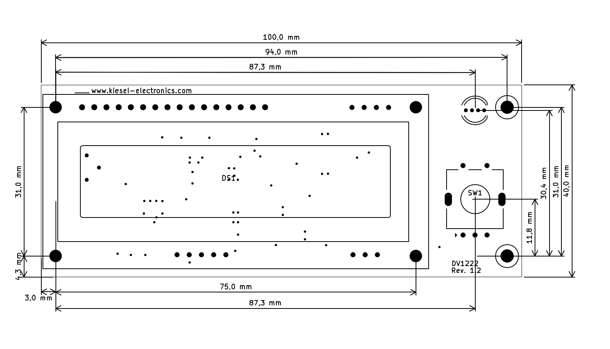
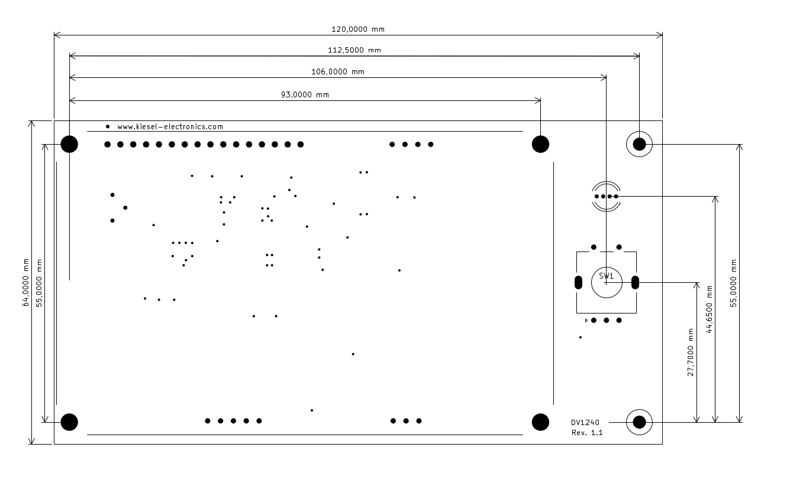
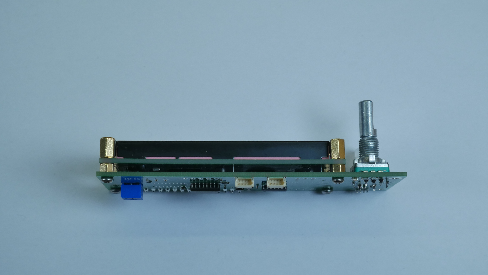
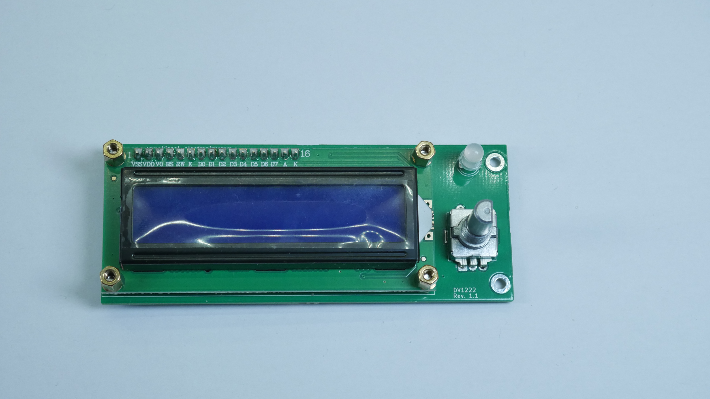

# LcdFrontPanel

The LcdFrontPanel module is a I2C based LCD front panel with a rotary encoder and a RGB LED.
It adds a user interface to you project just by connecting it via I2C. The unit contains two Qwiic/STEMMA QT connectors as well as a footprint for a pin-header. The module runs on 3.3V or 5V (the display contrast has to be adjusted when changing the supply voltage).
A demo application demonstrating a simple menu structure can be found in the [LcdApplication](LcdApplication/) subfolder. The schematic is available in the [Documentation](Documentation/) folder.
There are versions with 16x2 and 20x4 LCD displays. The circuit is the same for both display variants.

[](https://www.tindie.com/stores/kieselelectonic/?ref=offsite_badges&utm_source=sellers_KieselElectonic&utm_medium=badges&utm_campaign=badge_small)


The panel is designed for easy integration. The four studs around the display can be used to attach it to the front panel of a case.






There are two I2c devices on the PCB. The PCF8574 is attached to the LCD display. Since this is a very common chip for attaching LCD displays via an I2C bus, many available drivers support this combination.
The default I2C address of the LCD IO expander is 0x27. It can be changed with the help of three solder bridges. Please see the PCF8574 datasheet for details.

There is also a ATTiny414 on the board. This uC handles the rotary encoder and the RGB LED. Also, it is responsible for generating a negative power rail to allow proper LCD contrast adjustment with 3.3V supply voltage.
The source code for the microcontroller is available in the [Attiny414_FW](Attiny414_FW/) folder. For programming a new firmware version an debugger or programmer with support of UPDI is needed.
The default I2C address of the ATTiny is 0x34. When the solder bridge is closed; the address is changed to 0x54.

## Rotary Encoder

The microcontroller keeps two variables concerning the rotary encoder.
The first variable reflects the status of the rotary action. When the encoder is turned clockwise, the variable is increased, if it is turned counterclockwise the variable is decreased.
The second variable reflects the button presses on the encoder. With each button press, the value is increased.
The values can be read via I2C. A I2C read with 3 bytes request will be answered with the values of both variables. The following example code shows how the values can be retrieved.

```c++
    uint8_t ret = i2c->requestFrom(address, 3);
    if (3 <= i2c->available()) { // if three bytes were received
        enc_reading = i2c->read();  // receive low byte (overwrites previous reading)
        enc_reading |= i2c->read()<< 8; // receive high byte as lower 8 bits
        btn_reading = i2c->read();
        *encPos = enc_reading;
        *btnCnt = btn_reading;
    } else{
        ret = -1;
    }
```

## RGB LED

The on-board LED can be set via writing the RGB values in three bytes to the controller. The following example shows how to do it.

```c++
      i2c->beginTransmission(address);
      i2c->write(red);
      i2c->write(green);
      i2c->write(blue);
      i2c->endTransmission();
```


